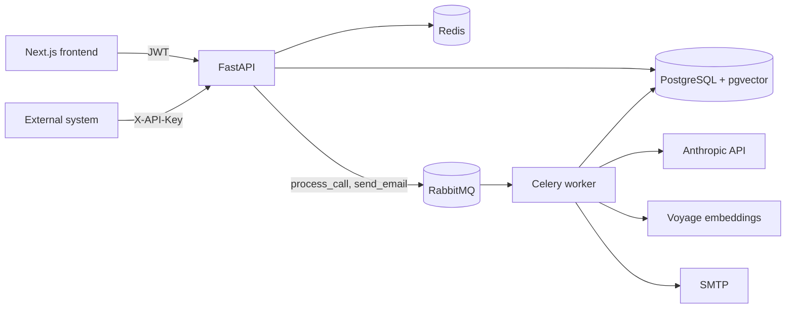

# Architecture

## Overview



- **API** handles auth, uploads, listings and statistics. It never calls the LLM inside a request.
- **Worker** runs the analysis pipeline and email delivery with retries.
- **PostgreSQL** stores everything, including transcript embeddings in a `vector(1024)` column.
- **Redis** holds rate limit counters only.
- **RabbitMQ** is the Celery broker.

## Layers

```
router → service → repository → SQLAlchemy
```

- **Routers** (`app/api`) validate input with Pydantic models, resolve the current user and return
  response models built with `model_validate`. No queries live here.
- **Services** (`app/services`) hold business rules and own the transaction (`commit`).
- **Repositories** (`app/repositories`) build queries and return models or rows.
- **Dependencies** (`app/api/deps.py`) wire services per request with one `AsyncSession`.

Errors are `AppException` subclasses. One handler turns them into
`{"detail", "code", "info"}` with the right status and headers, so clients branch on `code`
(`EmailNotVerified`, `InvalidCredentials`) rather than on message text.

## Call analysis pipeline

```
queued → transcribing → analyzing → done
                                  ↘ failed (error stored, task retried)
```

1. `POST /calls` stores the audio, creates the call in the uploader's organization and publishes
   `process_call`. Uploads with the same `external_id` return the existing call.
2. The worker creates the transcript and its segments. Speech-to-text is not wired yet: transcripts
   come from `app/fixtures/dialogues.py`.
3. The transcript is embedded (`VoyageEmbedder`, or a deterministic `FakeEmbedder` without a key).
4. **Retrieval**: the nearest transcripts from the same organization whose scores were confirmed by
   a person are loaded as examples.
5. **Analysis**: the transcript, the active checklist and the examples go to the model through
   structured output (`messages.parse` with a Pydantic schema). Each verdict has `passed`, a
   verbatim `quote` and `confidence`. The raw response is kept in `raw_ai_responses`.
6. **Scoring**: the total is the weighted share of passed items. An item the model did not return
   counts as failed and is logged. Failed required items are reported separately.

Task settings: `acks_late`, `prefetch_multiplier=1`, `reject_on_worker_lost`, so a crashed worker
does not lose a call. A call already in `done` is skipped on redelivery.

Without `ANTHROPIC_API_KEY` a `FakeAnalyzer` returns the expected verdicts for the fixture dialogue,
so the whole flow runs offline and in tests.

## Multi-tenancy and roles

Every user, call, checklist item and API key belongs to an organization. The organization comes
from the authenticated user, never from the request.

Visibility is a SQL condition built in one place, `app/repositories/scope.py`:

| Role | Calls and statistics | People |
|---|---|---|
| owner, admin | whole organization | whole organization |
| manager | own calls and calls of their operators | self and their operators |
| operator | own calls | self |
| super_admin | everything | everything |

- The condition is added to the `WHERE` clause of listings, reports, search, similar calls and
  every statistics query. Statistics functions take the scope as a required argument, so a new
  endpoint cannot forget it silently.
- A resource outside the scope returns **404**, not 403, so its existence is not revealed.
- Actions are checked with rules from `app/core/permissions.py` through `require(rule, action)`.
- Operators always upload calls for themselves; managers can upload only for their operators.
- Frontend permissions mirror these rules only to hide buttons.

## Authentication

- **Registration** creates the organization, its owner and a starter checklist, then sends a
  one-time verification link. Login is refused until the email is verified.
- **Invitations** create a user without a password; the link lets them set one.
- One-time tokens are random, stored only as SHA-256 hashes, expire after
  `EMAIL_VERIFICATION_TTL_HOURS` and are marked used.
- Registering a taken email returns the same response as a new one, so emails cannot be enumerated.
  A wrong password and an unknown email return the same error.
- Passwords use bcrypt. Access tokens are HS256 JWTs with a configurable lifetime.
- **API keys** belong to the owner's organization and are backed by a service user, so every
  permission and visibility rule applies to them unchanged. The secret is shown once; only its
  prefix and hash are stored. Revoking a key deactivates its user. `last_used_at` is written at
  most once per `API_KEY_TOUCH_SECONDS`. Service users are hidden from the team list.
- The **demo** account is enabled by `DEMO_ENABLED`, signs in without a password and is
  read-only: any non-read request returns 403.

## Rate limiting

- Sliding window in Redis, counted and checked atomically in one Lua script.
- Rules live in `settings.rate_limits` as `"limit/window_seconds"`, named by purpose:
  `ip`, `principal`, `login_ip`, `login_email`, `register`, `resend`, `verify`, `demo`.
- A refused request returns 429 with `Retry-After` and `X-RateLimit-*`; CORS exposes them.
- `X-Forwarded-For` is used only with `TRUST_FORWARDED_FOR=true`, otherwise any client could pick
  its own IP.
- If Redis is unavailable, requests pass by default (`RATE_LIMIT_FAIL_OPEN`) and the failure is
  logged; with fail-closed the API returns 503.

## Queries

- **Listings** run two statements (page and total) regardless of page size; related rows are
  loaded with `selectinload`. A test counts SQL statements to catch N+1 regressions.
- **Statistics** (`/stats/operators`, `/stats/checklist`, `/stats/daily`) are single `GROUP BY`
  queries. Failed required checks use a correlated `EXISTS`.
- **Daily statistics** group by date in `REPORT_TIMEZONE`, not UTC, so a call at 01:00 Kyiv time
  lands on the right day.
- **Sorting** accepts only whitelisted enum fields mapped to columns or aggregates. NULLs always go
  last, and `id` is the final key so pagination is stable. Roles sort by seniority, not by the
  order of the database enum.
- **Indexes**: `(operator_id, created_at, id)` and `(organization_id, created_at, id)` serve the
  default listing order for both filters.
- Value bounds (name, email and password lengths, page size, score range, search limits) are defined
  once in `app/core/limits.py` and mirrored in `frontend/lib/limits.ts`.

## Email

`Mailer` is a protocol with three transports chosen from settings: SMTP (465 as SMTPS, otherwise
STARTTLS), files in `MAIL_DIR`, or the log. With `MAIL_ASYNC=true` the message goes through the
`send_email` task with growing retries; if the broker is down it is sent inline.

The user is committed before a message is sent, so a mail failure never undoes a registration or an
invitation; the link can be requested again.

## Migrations

Migrations are linear and reviewed by hand. CI checks that there is one head, that models and
migrations match (`alembic check`), and that the chain downgrades to base and upgrades back.
Data migrations move existing rows into a default organization when tenancy was introduced.

## Testing

- Tests run against real PostgreSQL and Redis, not mocks, through the ASGI app.
- Celery publishing is replaced with a list, mail goes to the log, rate limits are off unless a test
  enables them with explicit thresholds.
- Covered areas: auth flows, isolation between companies and roles, people and invitations, API keys,
  rate limits, sorting, statistics, mail transports, demo restrictions, analysis scoring, RAG
  example selection and prompt building.

## Trade-offs and next steps

- **Speech-to-text** is not integrated; the worker uses fixture dialogues.
- **Vector search** uses an exact scan without an ANN index, which is fine at this size;
  an HNSW index is the next step for large volumes.
- **The frontend keeps the JWT in `localStorage`**: simple, but exposed to XSS. An `httpOnly`
  cookie behind the Next server is the stronger option.
- **No user cache**: every authenticated request loads the user by primary key, which keeps
  deactivation and role changes immediate.
